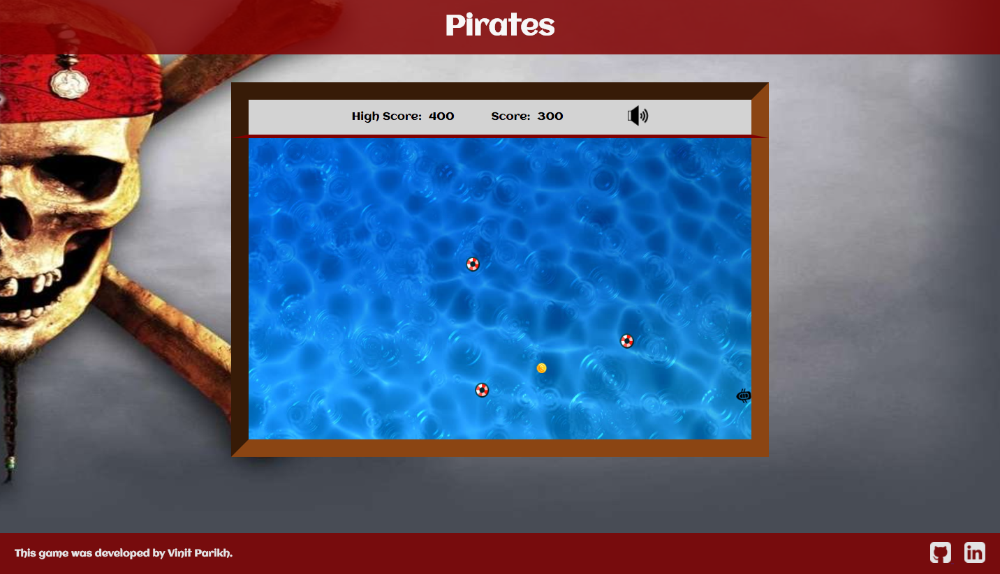

## Pirates

### Background

Pirates is a simple single player game in which the purpose, as the pirate, is to plunder as much treasure as possible without being hit by floating mines. The controls are simple, involving only the four arrow keys; forward and back move the ship in the respective directions, and left and right rotate the ship in its static position. Every time a treasure is claimed, a new mine is added to the playing field. In addition, the mines are intelligent and move towards the pirate ship.

The game can be played [here](https://www.google.com).

### Functionality & MVP

In this game of Pirates, users are able to:

- Start a new game and play again after losing
- Keep track of their total score and high score for the session
- Toggle between having sound effects on or off
- Play by moving the ship using four arrow keys

### Implementation

TODO

### Architecture and Technologies

Pirates is made simply with pure vanilla JavaScript along with HTML5 Canvas. No libraries are included anywhere in the game. Using vanilla DOM manipulation, HTML, and CSS, I created full gameplay with clean animations.

### Future Improvements

Some possible improvements to the game include:

##### Add Difficulty Options

Users can choose their difficulty between easy, medium, or hard. Another option is to increase the speed of the enemy mines as the user's score increases or to add whirlpools to pull and destroy the user's ship.

##### Multiple Treasures

Rather than having only one type of coin as treasure, coins worth different amounts can randomly spawn. Another possible feature is to spawn coins of higher value and only keep them available for a limited period of time.

##### Obstacles

In addition to mines, it would be possible to include additional obstacles, possibly for the more difficult levels of the game.
