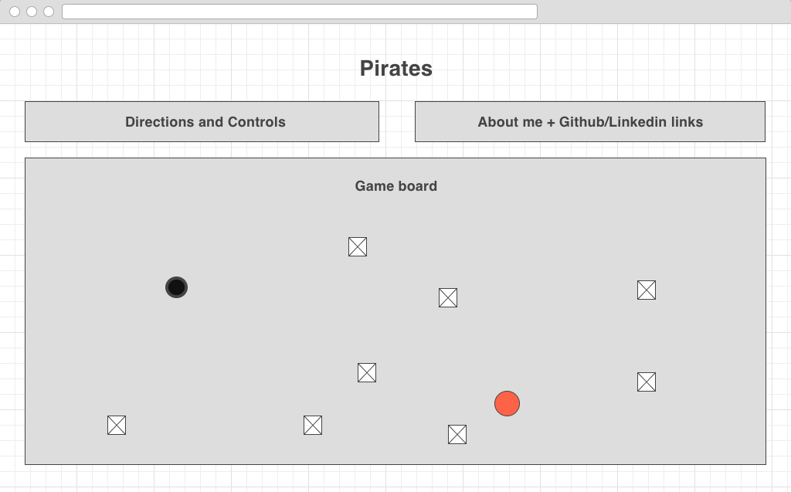

## Pirates

### Background

Pirates is a simple single player game in which the purpose, as the pirate, is to plunder as much treasure as possible without being hit by floating mines. The controls are simple, involving only the four arrow keys; forward and back move the ship in the respective directions, and left and right rotate the ship in its static position. Every time a treasure is claimed, a new mine is added to the playing field. In addition, the mines are intelligent and move towards the pirate ship.

### Functionality & MVP

In this game of Pirates, users will be able to:

- [ ] Start, pause, and reset the game
- [ ] Keep track of their total score

The project will also include:

- [ ] An intro describing the rules of the game, the controls, and which difficulty the user would like to play
- [ ] A production Readme

### Wireframes

The game will consist of one screen with a game board, controls listed on the side, and scorecard listed at the top. Start, pause, and reset buttons will also be displayed outside the game board for the user's convenience. Links to my Github and Linkedin will be included as well.

### Architecture and Technologies

The following technologies will be used for this project:

- Vanilla javascript and 'jQuery' for overall game structure
- 'HTML5 Canvas' for DOM manipulation and rendering
- Webpack to bundle and serve various scripts

In addition to the webpack entry file, the following files will be included:

- 'board.js': this file will handle creating and updating the canvas elements and rendering them to the DOM
- 'ship.js': this file will handle keeping track of the ship object and its attributes
- 'mine.js': this file will handle keeping track of all the mine objects and their attributes
- 'coord.js': this file will define a coordinate and possible moves from that coordinate
- 'main.js': this file will handle the actual gameplay with functions for the player to win or lose

### Implementation Timeline

**Day 1**: Setup all necessary Node modules and create 'webpack.config.js' and 'package.json files'. Write an entry file and attempt to render a ship to the canvas element.

- Get a green bundle with 'webpack'
- Create an outline of necessary files to be able to atleast render a ship object to the screen.

**Day 2**: Add listeners to be able to move ship object on screen using arrow keys. Limit object to moving only within specified game field.

- Be able to move ship around on playing field.

**Day 3**: Write out code to create mine elements and treasure elements, randomizing their positions.

- Make user lose when intercepted by mine
- Allow user to pick up treasure

**Day 4**: Write backend functionality to make mines move toward user's ship. Flesh out full page with instructions and relevant links.

- Enable mines to move towards user
- Polish up page with additional HTML and CSS with links to github/linkedin and instructions.

### Future Improvements

Some possible improvements to the game include:

- [ ] Add options for difficulty (easy, medium, hard)
- [ ] Add multiple possible treasure types worth different amounts
- [ ] Allow multiplayer
- [ ] Create obstacles in playing field
